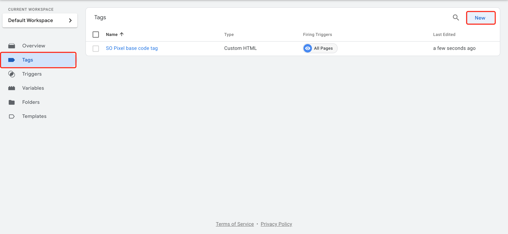
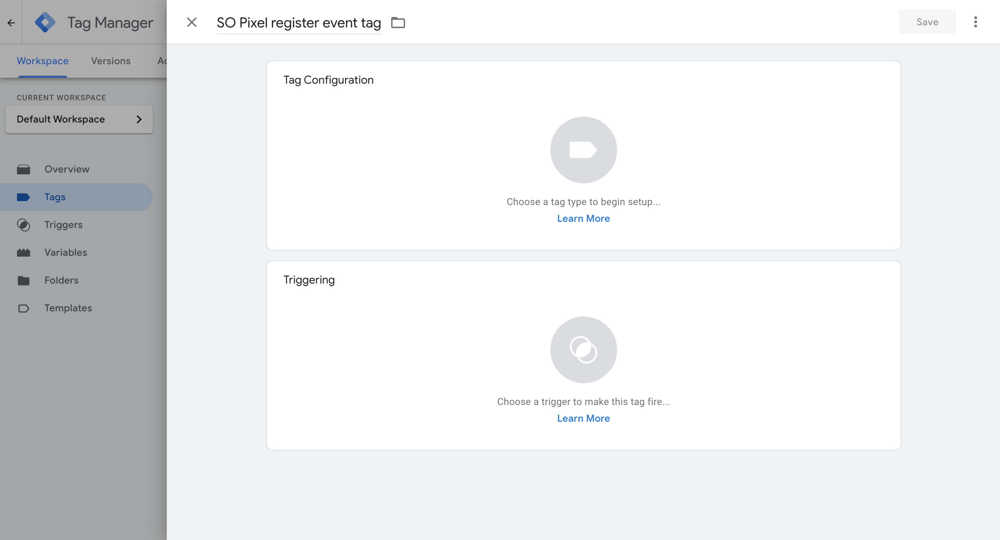
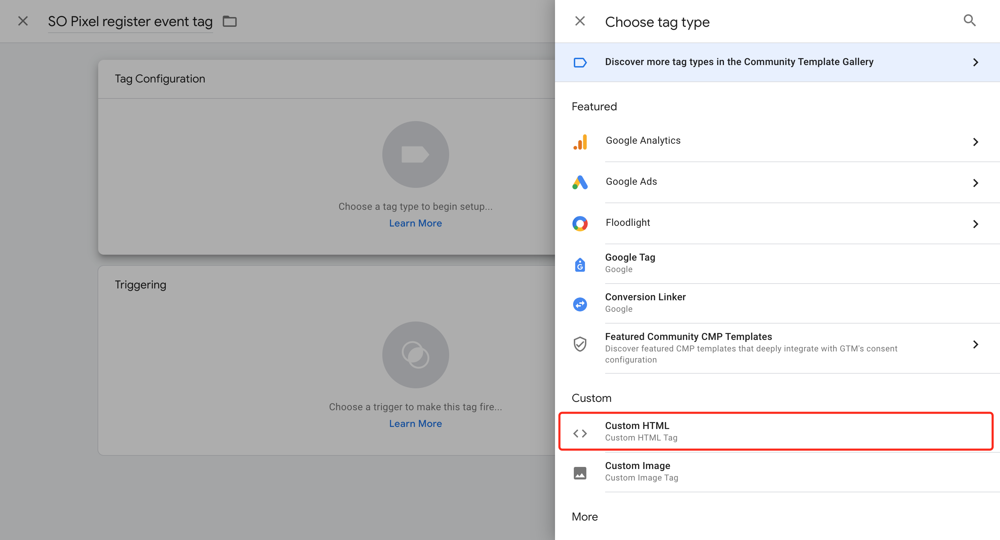
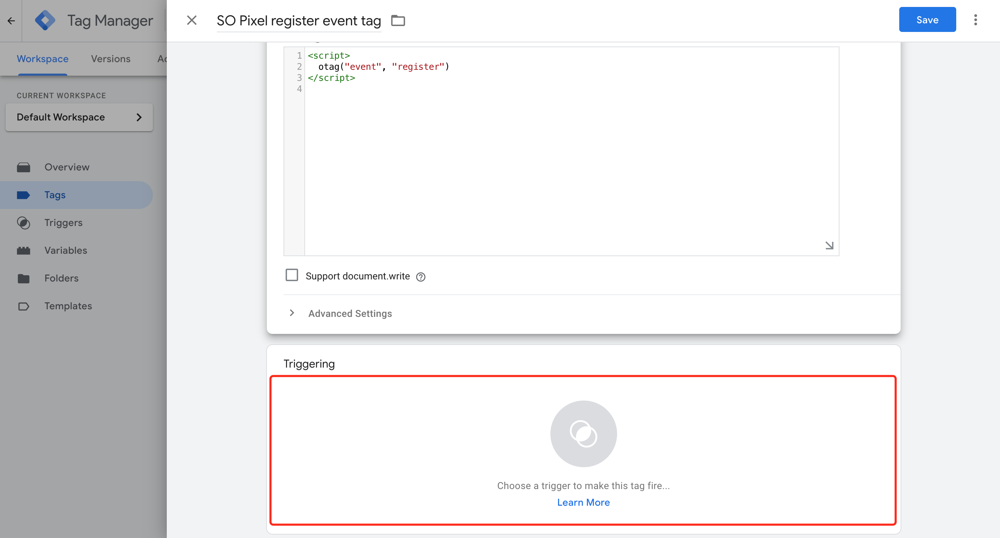
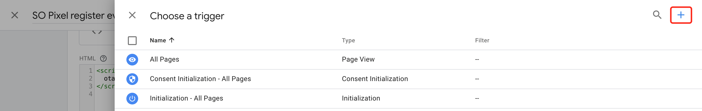
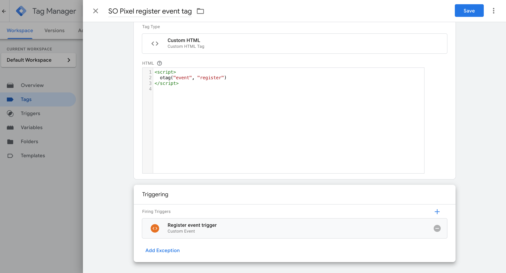

# OperaAds Pixel Integration Guide

This documentation is to demonstrate how to integrate OperaAds Pixel Code to Google Tag Manager.

## Step 1: Setup Opera Pixel in Google Tag Manager

Visit: [https://tagmanager.google.com/](https://tagmanager.google.com/)

If you do not have an account, create it in [https://tagmanager.google.com/](https://tagmanager.google.com/), such as:


### 1) Setup Base Code Tag

Add a new tag for Opera Pixel Base code, such as:


The above Custom HTML Tag content  is :
```javascript {5}
<!-- Opera Pixel Base Code -->
  <script>
  !(function(p,l,o,w,i,n,g){if(!p[i]){p.GlobalSnowplowNamespace=p.GlobalSnowplowNamespace||[];p.GlobalSnowplowNamespace.push(i);p[i]=function(){(p[i].q=p[i].q||[]).push(arguments)};p[i].q=p[i].q||[];n=l.createElement(o);g=l.getElementsByTagName(o)[0];n.async=1;n.src=w;g.parentNode.insertBefore(n,g)}})(window,document,"script","//res-odx.op-mobile.opera.com/sp.js","otag");

  otag('init', 'Your_Advertiser_Id')

  </script>
<!-- End Opera Pixel Base Code -->

```
::: warning
 Please ask the Opera Ads team for `Your_Advertiser_Id` and replace it above.
:::

### 2) Setup Event Tag and Trigger

You can set up multiple event tags, depending on how many events you want to trigger. Here is an **example** for triggering a "register" event.

#### 1. Click Tags > New.



#### 2. Enter a name for the register Event tag at the top(e.g., "Opera pixel register event tag").



#### 3. Click Tag Configuration panel, Choose tag type "Custom HTML"



Copy and paste the below code into the **HTML** content textbox:

```javascript
<script>
  otag("event", "register");
</script>
```

::: warning
The text "register" could be other event names such as "purchase" / "deposit"... Make sure to ask the Opera Ads team for the event name you can use.
:::


#### 4. Click Triggering panel, and it will open a drawer on the right side, click the plus(+) icon in the upper right corner, a new drawer will open, enter a name for the register event trigger(e.g., "Register event trigger"), then click Trigger Configuration panel, Choose trigger type "Custom Event". Input "register" into Event name textbox, click Some Custom Events, Set the condition as Event equals register(This is up to you, you can set another condition).





If you have set the related trigger before, just choose the trigger you want. For example


#### 5. Click the Save button, it will go back to Tag Configuration panel


#### 6. Continue to click the Save button, it will go back to Tags list


#### 7. Submit and Publish


## Step 2: Install Google Tag Manager on your website


Following the above tips to install Google Tag Manager.

## Step 3: Add event base code in your website
Such as:

```javascript
<script>
  $("#yourButton").click(function () {
    dataLayer.push({"event": "register"});
  });
</script>
```
The event base code is:

```javascript
dataLayer.push({"event": "register"});
```

## Example

```html {9-18,22-25,31}
<!DOCTYPE html>
<html lang="en">

<head>
  <meta charset="UTF-8">
  <meta http-equiv="X-UA-Compatible" content="IE=edge">
  <meta name="viewport" content="width=device-width, initial-scale=1.0">
  <title>Opera Pixel with Google Tag Manager</title>
  <!-- Google Tag Manager -->
  <script>(function (w, d, s, l, i) {
      w[l] = w[l] || []; w[l].push({
        'gtm.start':
          new Date().getTime(), event: 'gtm.js'
      }); var f = d.getElementsByTagName(s)[0],
        j = d.createElement(s), dl = l != 'dataLayer' ? '&l=' + l : ''; j.async = true; j.src =
          'https://www.googletagmanager.com/gtm.js?id=' + i + dl; f.parentNode.insertBefore(j, f);
    })(window, document, 'script', 'dataLayer', 'GTM-T9469VT');</script>
  <!-- End Google Tag Manager -->
</head>

<body>
  <!-- Google Tag Manager (noscript) -->
  <noscript><iframe src="https://www.googletagmanager.com/ns.html?id=GTM-T9469VT" height="0" width="0"
      style="display:none;visibility:hidden"></iframe></noscript>
  <!-- End Google Tag Manager (noscript) -->

  <button onclick="handleClickRegister()">register</button>

  <script>
    const handleClickRegister = () => {
      dataLayer.push({ "event": "register" });
    }

  </script>
</body>

</html>

```

Here is a <StaticLink href="/google-tag-manager-testing.html" target="_blank">Demo</StaticLink>