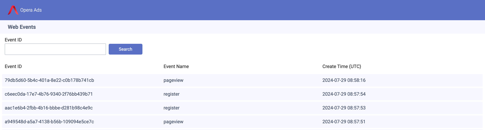
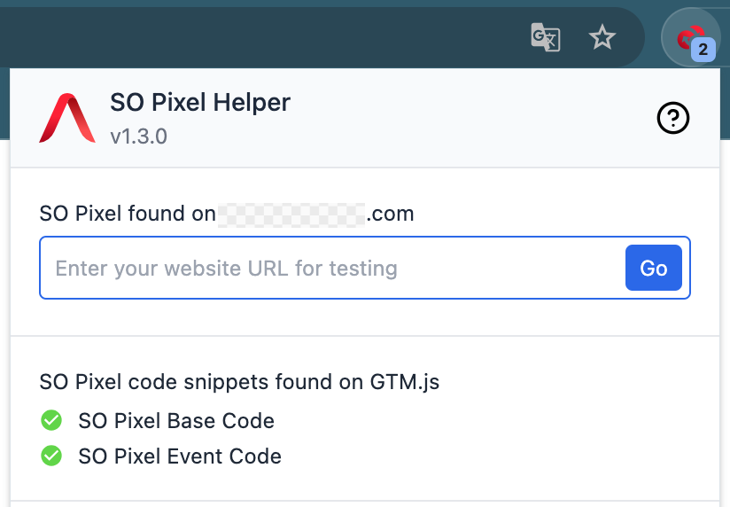

# SO Pixel Helper

## Overview

SO Pixel Helper is a browser extension that automatically detects whether the pixel code is installed and events are triggered successfully.

## Download & Install

Download [SO Pixel Helper](https://res.adx.opera.com/z/SOPixelHelper.zip), unzip it, and you will see an unzipped directory.

In Opera Browser, click Menu: View -> Show Extensions:  
In Chrome Browser, click Menu: Window -> Extensions:

1. Enable "Developer mode"
2. Install the extension by clicking “Load unpacked”, then choose the unzipped directory

Then you'll see SO Pixel Helper extension installed.

3. Pin the extension to keep it always visible

  

    
    (Opera browser)
  

  

    
    (Chrome browser)
  

## How To Use

1. Open the Opera or Chrome browser, and click on the SO Pixel Helper icon.
2. Enter the website URL in the input box below, and click the "Go" button to start testing.

Then perform the tests you want, such as page view, and the fired events will display on the extension.

You can also click the icon , which will open a new browser tab to show the test events.

## Troubleshooting

1. If SO Pixel is not found or not correctly integrated on the website, the extension will display the following UI.

2. If you use [Google Tag Manager to integrate SO Pixel](../integrate-pixel-to-gtm/), you should see the following UI if the integration is successful. If not, please check if your Google Tag Manager is configured correctly.

FYI: This test [link](https://doc.adx.opera.com/google-tag-manager-testing.html) uses Google Tag Manager. You can see test events by clicking the Register button.

3. If you see this error on the extension, it means you forgot to carry the query string `"opera_click_id"` from the first link to the second one when redirecting(SO Pixel needs this query string to work).

4. If you see this error in the browser console, it means that the SO Pixel base code is not integrated correctly on your website. Please check your integration.

