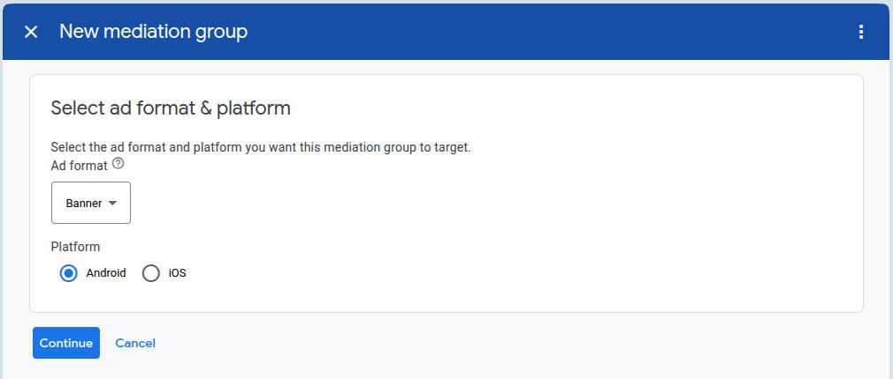
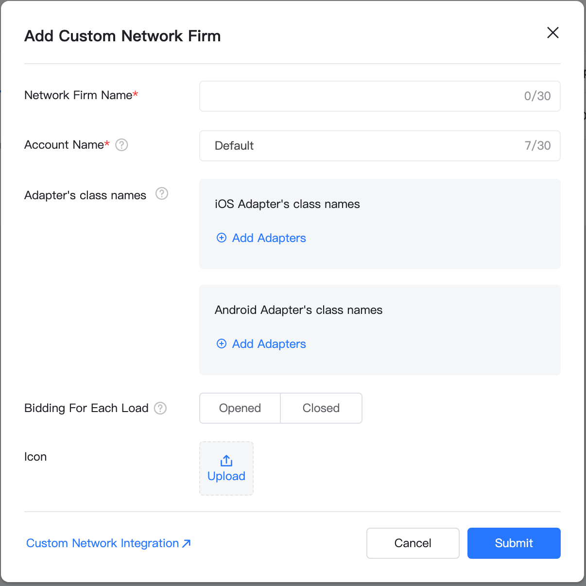
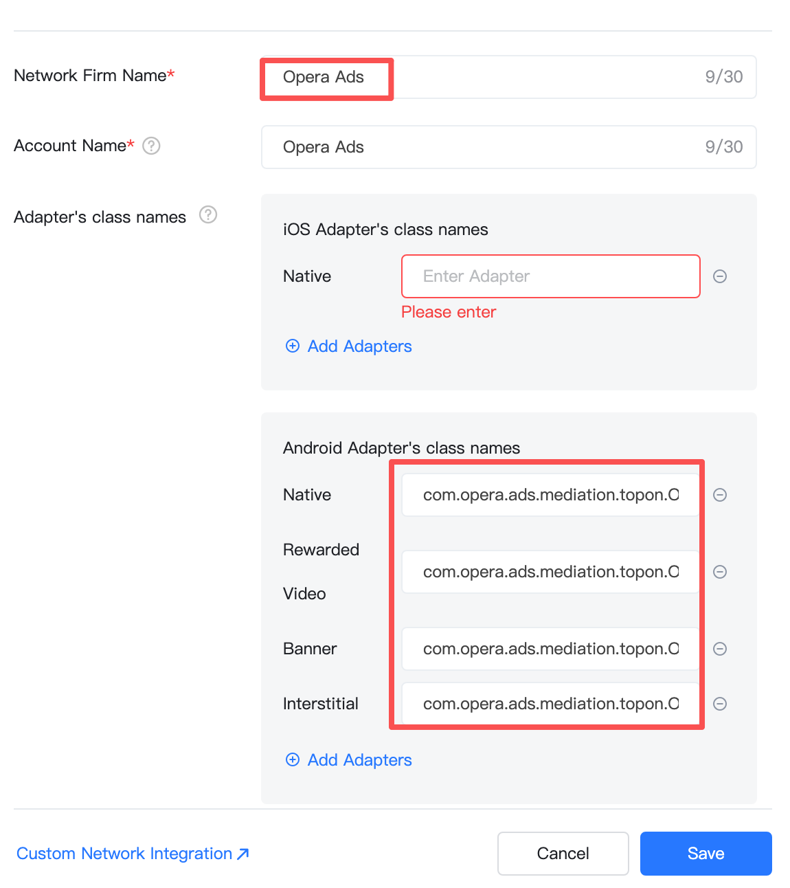
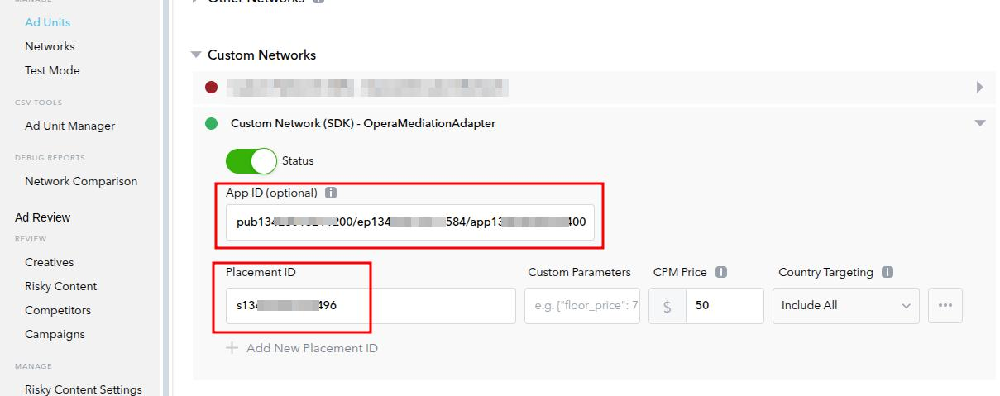

# Opera Ads Mediation Adapter Integration Guide

This guide explains how to integrate Opera Ads SDK through custom adapters into AdMob, TopOn (Anythink), and AppLovin MAX mediation platforms.

## Table of Contents

- [Overview](#overview)  
- [Prerequisites](#prerequisites)  
- [AdMob Mediation Integration](#admob-mediation-integration-by-custom-event)  
- [TopOn (Anythink) Mediation Integration](#topon-\(anythink\)-mediation-integration)  
- [AppLovin MAX Mediation Integration](#applovin-max-mediation-integration)  
- [FAQ](#faq)  
- [Technical Support](#technical-support)

---

## Overview

Opera Ads provides custom adapters for major mediation platforms, supporting integration through:

- **AdMob Mediation**
- **TopOn**
- **AppLovin**

---

## Prerequisites

Before you begin, ensure that:

1. You have registered on the [Opera Ads Developer Platform](https://ofp.adx.opera.com) and created your app
2. You have obtained your Opera Ads **App ID** and **Placement IDs** for each ad unit
3. You have created your app and ad units on the corresponding mediation platform (AdMob/TopOn/AppLovin)
4. Full support for kotlin integration begins with version 2.2.2.x

---

## AdMob Mediation Integration by Custom Event

### Supported Ad Formats

| Ad Format supported on Opera Ads   | AdMob                   |
| :--------------------------------- | :---------------------- |
| Banner (320x50, AdSize.BANNER)     | AdSize.BANNER           |
| MREC (300x250, AdSize.BANNER_MREC) | AdSize.MEDIUM_RECTANGLE |
| Interstitial                       | Interstitial            |
| Rewarded                           | Rewarded                |
| Native                             | Native                  |

### 1. Configure Custom Event in AdMob Console

You need to add Opera to the mediation configuration for your ad unit.

First, sign in to your [AdMob account](https://apps.admob.com/). Next, navigate to the **Mediation** tab. If you have an existing mediation group you'd like to modify, click the name of that mediation group to edit it, and skip ahead to Add Opera as an ad source.  
To create a new mediation group, select Create **Mediation Group**.  
  
Enter your ad format and platform, then click **Continue**.  
  
Give your mediation group a name, and select locations to target. Next, set the mediation group status to **Enabled**, and then click **Add Ad Units**.  
  
Associate this mediation group with one or more of your existing AdMob ad units. Then click **Done**.  
  
You should now see the ad units card populated with the ad units you selected:  


**Add Opera as custom event**  
Under the **Waterfall** card in the **Ad Sources** section, select **Add custom event**. Fill in the “_Label_” and “_eCPM_”, and press **continue**.  
  
In the **Map ad units** popup window choose one AdMob ad unit to map to the custom event you just created, and click **Add mapping**. Click **Add mapping** again to get into the **Edit ad unit** mapping dialog.  
  
Name this mapping, and fill in the **_Class Name_** with “com.opera.ads.mediation.admob.OperaMediationAdapter”. The **_parameters_** is as following:

```json
{
  "appId": "YOUR_OPERA_APP_ID",
  "placementId": "YOUR_OPERA_PLACEMENT_ID"
}
```

### 2. Add Dependencies

Add Opera Ads SDK maven repository:

```
repositories {
    maven {
        url = uri("https://artifact.op-mobile.opera.com/releases")
    }
}
```

Add the following dependencies to your app's `build.gradle` or `build.gradle.kts` file:

```
dependencies {
    // Opera Ads AdMob Adapter
    implementation 'com.opera:opera-ads-admob-adapter:2.2.0.0'

    // Google Mobile Ads SDK
    implementation 'com.google.android.gms:play-services-ads:24.8.0'
}
```

### 3. Additional code required

The AdMob SDK automatically initializes the Opera Ads SDK when loading ads. No additional initialization code is required.

### 4. Privacy Compliance

##### GDPR

Please refer to [https://doc.adx.opera.com/ofs/android/\#gdpr](https://doc.adx.opera.com/ofs/android/#gdpr), Opera Ads SDK read application’s consent string automatically.

##### COPPA

Opera Ads SDK reads the tag of **TFUA** from AdMob _RequestConfiguration_ and passes it to the Ad network every time requesting an ad.

##### CPPA

Please refer to [https://doc.adx.opera.com/ofs/android/\#u-s-states-privacy-ccpa](https://doc.adx.opera.com/ofs/android/#u-s-states-privacy-ccpa), to comply with US states privacy laws, you have to invoke “PrivacyManager.setUSPrivacy("....")” to set the status of CCPA manually.

### 5. Adapter Version Compatibility

| Adapter Version | Opera Ads SDK | AdMob SDK |
| :-------------- | :------------ | :-------- |
| 2.4.0.0         | 2.4.0         | 24.6.0+   |

---

## TopOn (Anythink) Mediation Integration

### Supported Ad Formats

| Ad Format supported on Opera Ads   | TopOn                      |
| :--------------------------------- | :------------------------- |
| Banner (320x50, AdSize.BANNER)     | Banner ( size \= 320x50 )  |
| MREC (300x250, AdSize.BANNER_MREC) | Banner ( size \= 300x250 ) |
| Interstitial                       | Interstitial               |
| Rewarded                           | Rewarded Video             |
| Native                             | Native                     |

### 1. Configure Custom Ad Network in TopOn Console

Refer to [Custom Network](https://help.toponad.net/docs/Custom-Network-integration-instructions) on TopOn **Mediation Network Guide** for detailed information.

#### 1.1 Add Custom Ad Network

1. Sign in to the [TopOn Console](https://portal.toponad.com)
2. Navigate to **Mediation** → **Network** → **Custom Network**
3. Click **Add Custom Network**



#### 1.2 Configure Adapter Class Names for Different Ad Formats

TopOn requires separate adapter classes for each ad format:

| Ad Format    | Adapter Class Name(Android)                              |
| :----------- | :------------------------------------------------------- |
| Native       | `com.opera.ads.mediation.topon.OperaNativeAdapter`       |
| Banner       | `com.opera.ads.mediation.topon.OperaBannerAdapter`       |
| Interstitial | `com.opera.ads.mediation.topon.OperaInterstitialAdapter` |
| Rewarded     | `com.opera.ads.mediation.topon.OperaRewardAdapter`       |



### 1.3 Banner

After Ad Network is added, click **Ad Source Settings**. Select banner format ad units, click **Add Ad Source.** Please set the correct size for corresponding Opera Banner AdSize when you add an “Ad Source” for the ad unit of Banner on TopOn console. The “size” of **AdSize.Banner** should be “_320x50_”, and for **AdSize.BANNER_MREC** it should be “_300x250_”.

And also please also make sure enable \***Bottom Ads**\* on, for Opera Ads network to be the backfill ad network for unbidded requests.  


### 2. Add Dependencies

Add Opera Ads SDK maven repository:

```
repositories {
    maven {
        url = uri("https://artifact.op-mobile.opera.com/releases")
    }
}
```

For the versions of TopOn SDK before **6.5.12**, add the following dependencies to your app's `build.gradle` or `build.gradle.kts` file:

```
dependencies {
    // Opera Ads TopOn Adapter
    implementation 'com.opera:opera-ads-topon-anythink-adapter:2.2.0.0'

    // TopOn SDK (Anythink package name - for SDK < 6.5.12)
    implementation 'com.anythink.sdk:core-tpn:6.4.17'
    implementation 'com.anythink.sdk:banner-tpn:6.4.17'
    implementation 'com.anythink.sdk:interstitial-tpn:6.4.17'
    implementation 'com.anythink.sdk:rewardedvideo-tpn:6.4.17'
    implementation 'com.anythink.sdk:nativead-tpn:6.4.17'
}
```

Since Opera Ads SDK v2.4.0, we support TopOn SDK \>= 6.5.12, add the dependencies as following:

```
dependencies {
    // Opera Ads TopOn Adapter for package name "com.secmtp.sdk"
    implementation 'com.opera:opera-ads-topon-secmtp-adapter:2.4.0.0'

    // TopOn SDK (Anythink package name - for SDK >= 6.5.12)
    implementation 'com.anythink.sdk:core-tpn:6.5.12'
    implementation 'com.anythink.sdk:banner-tpn:6.5.12'
    implementation 'com.anythink.sdk:interstitial-tpn:6.5.12'
    implementation 'com.anythink.sdk:rewardedvideo-tpn:6.5.12'
    implementation 'com.anythink.sdk:nativead-tpn:6.5.12'
}
```

### 3. Additional code required

#### Native Ad

You can place the Ad Choice Icon on the ad view via TopOn local extra parameters. The default position is top right, and “ATAdConst.AD_CHOICES_PLACEMENT_INVISIBLE” is not supported.

```java
Map<String, Object> localExtra = new HashMap<>();
// Specify the position of the 'i' icon
localExtra.put(ATAdConst.KEY.AD_CHOICES_PLACEMENT, ATAdConst.AD_CHOICES_PLACEMENT_TOP_LEFT);
mATNative.setLocalExtra(localExtra);
```

### 4. Privacy Compliance

##### GDPR

Please refer to [https://doc.adx.opera.com/ofs/android/\#gdpr](https://doc.adx.opera.com/ofs/android/#gdpr), Opera Ads SDK read application’s consent string automatically.

##### COPPA

Please refer to [https://doc.adx.opera.com/ofs/android/\#coppa](https://doc.adx.opera.com/ofs/android/#coppa). It’s recommended to use the API “`PrivacyManager.setCoppa(...)`” to set _coppa_ status.

##### CPPA

Please refer to [https://doc.adx.opera.com/ofs/android/\#u-s-states-privacy-ccpa](https://doc.adx.opera.com/ofs/android/#u-s-states-privacy-ccpa). It’s recommended to use the API “`PrivacyManager.setUSPrivacy(...)`” to set the compliance status of CCPA.

### 5. Adapter Version Compatibility

| Adapter Version | Opera Ads SDK | TopOn SDK        |
| :-------------- | :------------ | :--------------- |
| 2.4.1.0         | 2.4.1         | >= 6.5.12        |
| 2.3.0.0         | 2.3.0         | 6.4.17 \~ 6.5.11 |

---

## AppLovin MAX Mediation Integration

### Supported Ad Formats

| Ad Format supported on Opera Ads   | AppLovin     |
| :--------------------------------- | :----------- |
| Banner (320x50, AdSize.BANNER)     | Banner       |
| MREC (300x250, AdSize.BANNER_MREC) | MREC         |
| Interstitial                       | Interstitial |
| Rewarded                           | Rewarded     |
| Native                             | Native       |

### 1. Configure Custom Network in AppLovin Console

Please refer to [Integrating custom SDK networks](https://support.axon.ai/en/max/mediated-network-guides/integrating-custom-sdk-networks/) on Max **Mediated network guides** for detailed information.

#### 1.1 Add Custom SDK Network

1. Sign in to the [AppLovin MAX Dashboard](https://dash.applovin.com)
2. Navigate to **MAX** → **Mediation** → **Manage** → **Networks**
3. Click **Click here to add a Custom Network** at the bottom of the page.
4. Fill in the following information:
   - **Network Type**: SDK
   - **Network Name**: OperaMediationAdapter
   - **Android / Fire OS Adapter Class Name**: `com.opera.ads.mediation.applovin.OperaMediationAdapter`


#### 1.2 Configure Ad Units

On the **Ad Units** page, add Opera Ads as an ad source for each ad unit:

1. Select an ad unit → **Custom Networks** → Find **OperaMediationAdapter**
2. Click **Enable** to activate it
3. Configure **Custom Parameters**



**Parameter Description**:

- `App ID`: Your App ID from Opera Ads (required)

- Placement ID: Placement id from Opera Ads.

### 2. Add Dependencies

Add Opera Ads SDK maven repository:

```
repositories {
    maven {
        url = uri("https://artifact.op-mobile.opera.com/releases")
    }
}
```

Add the following dependencies to your app's `build.gradle` or `build.gradle.kts` file:

```
dependencies {
    // Opera Ads AppLovin Adapter
    implementation 'com.opera:opera-ads-applovin-adapter:2.2.0.0'

    // AppLovin MAX SDK
    implementation 'com.applovin:applovin-sdk:13.5.0'
}
```

### 3. Additional code required

No additional code is required for InMobi integration.

### 4. Privacy Compliance

##### GDPR

Please refer to [https://doc.adx.opera.com/ofs/android/\#gdpr](https://doc.adx.opera.com/ofs/android/#gdpr), Opera Ads SDK read application’s consent string automatically.

##### COPPA

Please refer to [https://doc.adx.opera.com/ofs/android/\#coppa](https://doc.adx.opera.com/ofs/android/#coppa). It’s recommended to use the API “`PrivacyManager.setCoppa(...)`” to set _coppa_ status.

##### CPPA

`OperaMediationAdapter` updates the compliance status of CCPA from Applovin mediation configuration automatically requesting ads. But you can use the API “`PrivacyManager.setUSPrivacy(...)`” to change or reset the status. Please refer to [https://doc.adx.opera.com/ofs/android/\#u-s-states-privacy-ccpa](https://doc.adx.opera.com/ofs/android/#u-s-states-privacy-ccpa) for more information.

### 5. Adapter Version Compatibility

| Adapter Version | Opera Ads SDK | AppLovin SDK |
| :-------------- | :------------ | :----------- |
| 2.4.0.0         | 2.4.0         | 13.5.0+      |

---

## FAQ

### 1. Why can't I load or see an Ad?

**Possible Causes**:

- Incorrect App ID or Placement ID configuration
- Opera Ads SDK not initialized properly
- Network issues or low ad fill rate

**Solutions**:

- Verify that console configuration parameters are correct
- Enable logging to view detailed error information:

### 2. How can I request or load ads for testing?

The Opera Ads SDK automatically returns test ads in debug mode. Ensure:

- Add your device as a test device in the [Opera Ads console](https://ofp.adx.opera.com/)

### 3. Why doesn't Banner ads refresh?

Opera Ads Adapters automatically disable the Opera Ads SDK's auto-refresh feature, allowing the mediation platform to control refresh logic:

```java
// Automatically called inside the adapter
bannerAdView.setAutoRefreshEnabled(false);
```

### 4. Why do I encounter OkHttp3 related errors during compilation or runtime after integrating Opera Ads SDK?

**A:** Opera Ads SDK depends on OkHttp 4.X as default. If your app depends on an older version of OkHttp as 3.X, please upgrade to version of 4.X in your project, or contact us for help.

---

## Technical Support

For questions or support, please contact:

- **Documentation**: [Opera Ads Developer Documentation](https://doc.adx.opera.com/ofs/android/)
- **Technical Support**: [ad-sdk-support-list@opera.com](mailto:ad-sdk-support-list@opera.com)

---
